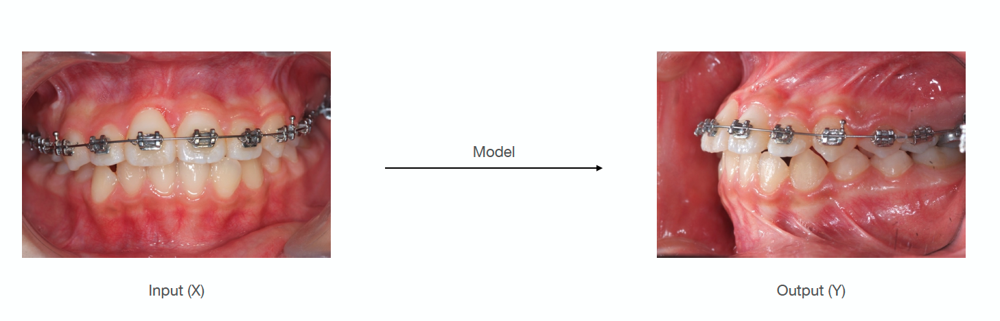

</img>

## GITA (General Image to Image Translation Architecture) - Pytorch

(**On going**)   

It is an official implementation of GITA, General Image to Image Translation Architecture. Most codes are largely folked from and motivated by [GLIDE-text to image repository](https://github.com/openai/glide-text2im.git). GITA takes ~
